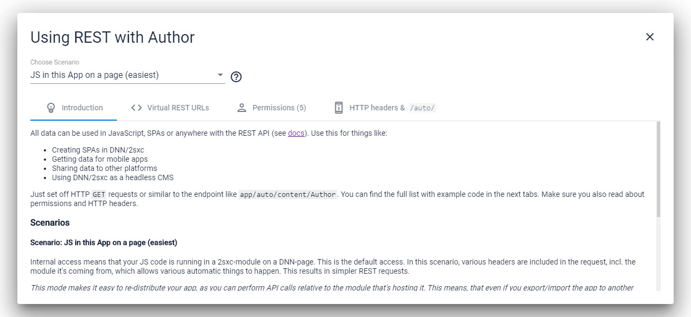
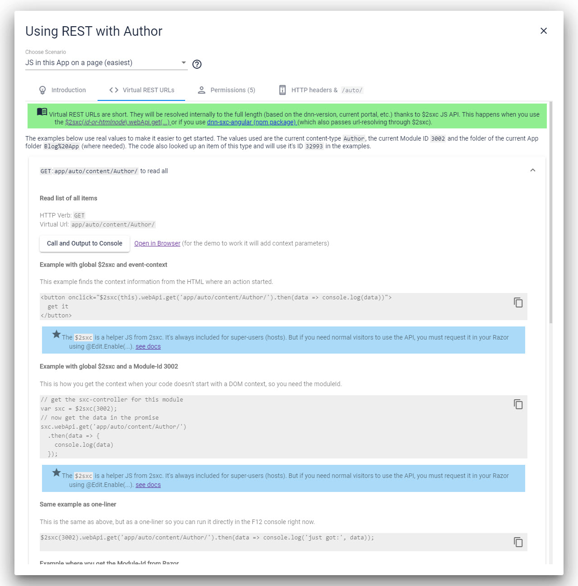

# Built-in WebApi Help in the Admin-Dialogs _(new in v11.10)_

In 2sxc 11.10 we added dialogs in the Admin-UI so it's easier to figure out the endpoints. These UIs also show sample code and everything. 

> [!TIP]
> In 2sxc 11.10 this dialog was introduced for the **Data** section, and we'll add similar sections for **Query** and **WebApi**. 

## History

1. Introduced in 2sxc 11.10
