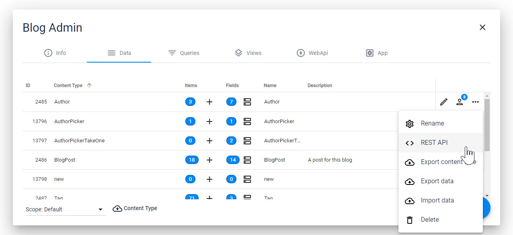

# URLs for 2sxc WebAPI and REST APIs

> [!TIP]
> The exact schema for the url varies depending on the platform you're using. 
> So DNN 7 is different from DNN 9, and Oqtane is different again.
>
> Also older versions of 2sxc had URLs which still work today but are not recommended any more, 
> because they were not well structured. 
> 
> In 2sxc 11.10+ we introduced REST-API help dialogs in the Admin-UI, so from now on
> you 2sxc will tell you what URLs you can use. 
> 
> So the information you find here is valid, but you probably don't need it

## Finding the right URLs in the Admin-Dialogs _(new in v11.10)_

> [!TIP]
> 
> Starting in 2sxc 11.10+ the admin-UI has [built-in help](xref:WebApi.Help.AdminUiContentRest) to get started. These UIs also show sample code and everything.
> So you probably don't need to read the stuff here and just go ahead with that. 

> [!TIP]
> In 2sxc 11.10 this dialog was introduced for the **Data** section, and we'll add similar sections for **Query** and **WebApi**. 
> So the remaining information on this page is really only for those who really want to dive in deep. 

## URL Schema Specifications (Advanced)

One of the most confusing aspects when using the REST API or custom WebApis is finding the right URL to talk to the API. Read this to help you understand what's going on and get started quickly. 

Every 2sxc REST URL is built with the following parts:

`[root]/app/[app-identity]/[app-part]/[specifics]`

1. The `root` is determined by DNN and changes a bit by DNN version, portal, and language configuration. [more](#part-1-the-root-path)
1. The `app-identity` says what app we're addressing. It's often `auto` for auto-detection, but when auto-detection isn't available, it's the app-folder name. [more](#part-2-the-app-identity)
1. the `app-part` determines if we're accessing [content](#part-3a-app-part-content), [query](#part-3b-app-part-query) or [api](#part-3c-app-part-custom-c-web-api) of the app.
1. The `specifics` is a path part describing what exactly what we're accessing and varies depending on the API.

## Part 1: The Root Path

### The Root in DNN 9+

In DNN 9 the root was shortened to: `[portal-root-with-language]/api/2sxc/...`

> [!NOTE]
> The old root from DNN 7 and 8 still work in DNN 9 for compatibility. 

### The Root in DNN 7 and 8

DNN 7 & 8: `[portal-root-with-language]/desktopmodules/2sxc/api/...`

> [!WARNING]
> An easy thing to overlook is that in DNN 7 and 8 it was `2sxc/api` but in DNN 9 it's `api/2sxc`

### The Root in Oqtane

This is still WIP, but most likely it's `[domain]/[site-id-number]/api/2sxc/...`

## Part 2: The App-Identity

### When to use or not-use Auto-Detection `auto`

The App-identity can be either the word `auto` to use auto-detection, or the app-folder-name if you can't use auto-detection. 

> [!TIP]
> Whenever you're working in DNN and accessing the endpoint from a module that contains the same App, then you should use auto-detection. 

> [!WARNING]
> Auto-Detection relies on DNN mechanisms to detect the **Context** (usually sending the `PageId` and `ModuleId` in HTTP-headers). 
> 2sxc uses these headers to figure out what App you're using. If something fails in auto-detection, you're probably not using the normal DNN conventions for making REST calls.

> [!WARNING]
> When calling an endpoint from another website or a mobile App, you cannot use `auto` but must specify the app-folder name.
> Or you can provide **Context** by adding `?PageId=...&ModuleId=...` to the url.

> [!TIP]
> If you're _not_ using auto-detection, then the root path must be absolutely correct. Here's why: If you have multiple portals then each portal could have other apps, or sometimes even the same app (like a Blog app). In this case, the root-path says what portal is being used, which in turn is important to get the correct app.

### App-Identity Examples

To access an API (in this example the `content`) from JS code in the same app you can rely on auto-detection of the app, like this: 

`.../app/auto/content/...`

To access the same Glossary-App from elsewhere, like from the skin (for example, to highlight all words to which your glossary-app has definitions), from another app, or from another website, you would specify the folder name as auto-detection won't work. Like this:

`.../app/Glossary/content/...`

This applies to all endpoints like `content`, `query`, `api`.

## Part 3: App-Part Content, Query or Web-Api

### Part 3a: App-Part Content
If your part is `content` then you're using the normal content/entity REST API. It supports all common HTTP verbs. In this case you have the following possibilities after `content/`:

* `.../content/[YourContentType]` 
  * HTTP GET will retrieve all items of this type
- `.../content/[your-content-type]/[item-id]` where `item-id` is the number or the GUID
  * HTTP GET will get one item
  * HTTP POST is used to create an item or update it
  * HTTP DELETE will delete the item

> [!WARNING]
> This requires that permissions are configured to allow it. 
> The permissions are very powerful so make sure you understand them. 

> [!TIP]
> You can also configure permissions in ways that allow users to only create draft items
> (which would then require an admin to publish it)

#### Content Example

Assume you have the [blog-app](xref:App.Blog) installed and your JS would request a JSON from this endpoint (logged in as host, so security is not an issue):

`[root-path]/app/auto/content/BlogPost`

...then your JS would receive a JSON with all BlogPost items. More examples:

1. Reading `[root-path]/app/auto/content/BlogPost/1050` would give you exactly one BlogPost item (with the id 1050)
1. HTTP POST to `[root-path]/app/auto/content/BlogPost/1050` with a POST body of `{ "Title": "changed title"}` would let you update the item 1050.

### Part 3b: App-Part Query

The Query endpoint can be accessed on `.../query/[your-query-name]`. Note that Query endpoints only support the HTTP-verb GET, since it's read-only. 

> [!WARNING]
> This requires that permissions are configured to allow it. 
> The permissions are very powerful so make sure you understand them. 

> [!TIP]
> Make sure you give your queries simple names without spaces if you intend to use them in REST calls.

> [!TIP]
> Queries can also expect url-parameters if they are configured to do this. 
> So if you query has an ID-filter which expects a token `[QueryString:id]` you can also call your query like
> `.../app/auto/query/GetWithId?id=27`

#### Query Example

Assume you have the [blog-app](xref:App.Blog) installed and your JS would request a JSON from this endpoint (logged in as host, so security is not an issue):

`[root-path]/app/auto/query/BlogPostsByAuthor?Author=Daniel%20Mettler`  

This would run the pre-defined query and return the Blog Posts of the author _Daniel Mettler_.

### Part 3c: App-Part Custom C# Web Api

Custom WebAPI use one of these schemas

1. `.../api/[controller-name]/[action-or-more-params]`
1. `.../[edition]/api/[controller-name]/[action-or-more-params]`

Your C# code determines what HTTP-verbs will work (GET, POST, etc.). Your code is also responsible for determining what permissions are used, like Anonymous etc.

The `[edition]` is relevant if you're using [Polymorphism](xref:Specs.Cms.Polymorphism). So if you don't specify an edition, the controller is expected to be in the `[AppFolder]\api` but if you do use polymorphism the controller must be in `[AppFolder]\[edition]\api`. 

## Read also

- [DotNet WebApi](xref:WebApi.Custom)
- [Concepts: Polymorphisms](xref:Specs.Cms.Polymorphism)

## Demo App and further links

You should find some code examples in this demo App

- [Razor Web API tutorials](xref:Tut.WebApi)
- [REST and WebApi Tutorial](http://2sxc.org/en/apps/app/tutorial-javascript-rest-api-using-jquery-and-angularjs)
- [Mobius Forms App](https://2sxc.org/en/apps/app/mobius-forms)

## History

1. Introduced in 2sxc 5.x
1. Query added in 2sxc 8.10
2. Enhanced with Polymorph Editions in 2sxc 9.35 (allowing edition-folder/api)
